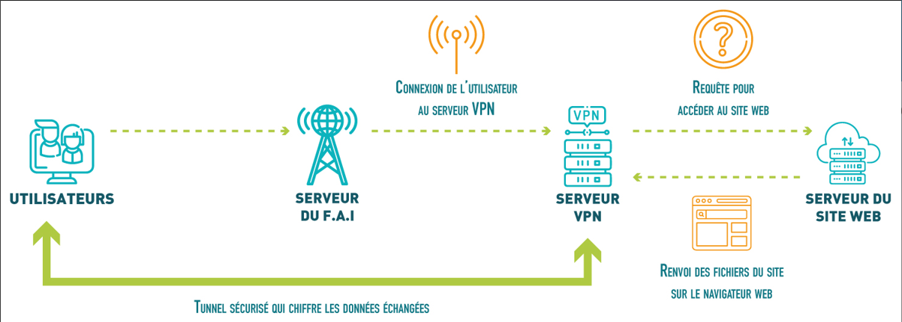
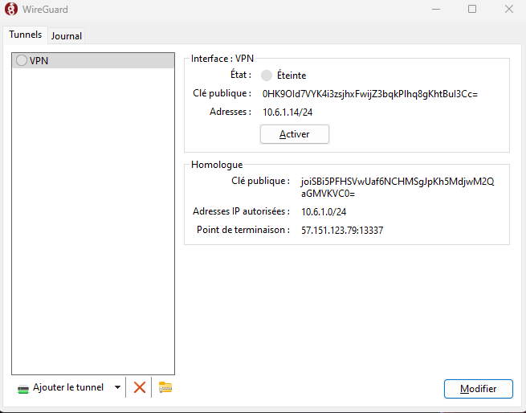
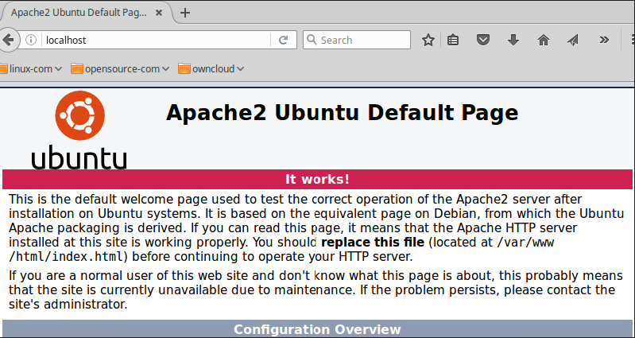
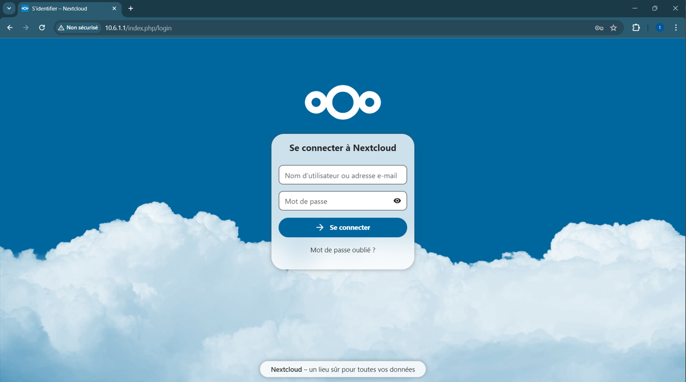
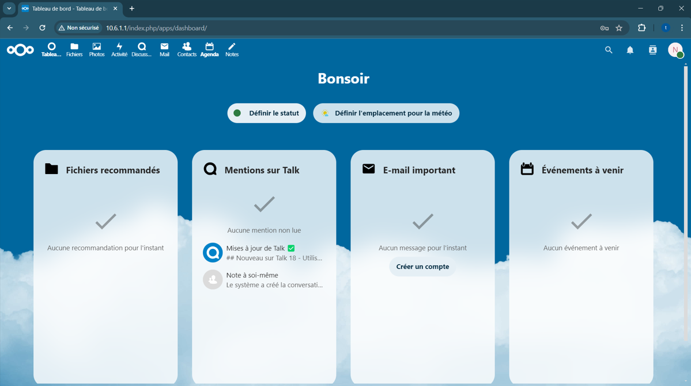

# Projet Infra et Réseau

<br>
<br>
<br>
<br>

# Table des matières

1. [Objectifs du projet](#objectifs-du-projet)
2. [Présentation d'un serveur VPN et de Wireguard](#présentation-dun-serveur-vpn-et-de-Wireguard)
3. [Présentation de NextCloud, Apache et la database](#présentation-de-nextcloud-apache-et-la-database)
4. [Prérequis d'installation](#prérequis-dinstallation)
5. [Installation du serveur VPN](#installation-du-serveur-vpn)
6. [Installation d'Apache](#installation-dapache)
7. [Installation de la database (mariadb)](#installation-de-la-database-mariadb)
8. [Configuration de NextCloud](#configuration-de-nextcloud)
9. [Mise en relation VPN et NextCloud](#mise-en-relation-vpn-et-nextcloud)
10. [Difficultés rencontrées](#difficultés-rencontrées)
11. [Répartition du travail au cours des séances](#Répartition-du-travail-au-cours-des-séances)
11. [Participants au projet](#Participants-au-projet)
<br>
<br>
<br>
<br>

# Objectifs du projet

Le principal objectif de ce projet est de déployer un environnement sécurisé sur Microsoft Azure, comprenant un serveur VPN, un serveur Apache et une instance Nextcloud. Les objectifs spécifiques sont les suivants :

1. **Création d'un serveur VPN sur Azure :**
   - Configurer un serveur VPN pour permettre des connexions sécurisées depuis des clients distants.

2. **Installation d'Apache et de Nextcloud :**
   - Déployer un serveur Apache pour servir de plateforme web.
   - Installer et configurer une instance Nextcloud pour le stockage et le partage de fichiers.

3. **Restriction d'accès à Nextcloud :**
   - Configurer les règles de pare-feu pour n'autoriser l'accès à la page web de Nextcloud qu'aux utilisateurs connectés au VPN.
   - Assurer que la page web Nextcloud ne soit pas accessible depuis l'extérieur du réseau VPN.

En mettant en place ces objectifs, nous créons un environnement sécurisé où seuls les utilisateurs authentifiés via le VPN auront accès aux données et aux services fournis par le serveur Nextcloud. Cela garantit la confidentialité et la sécurité des informations stockées et échangées via la plateforme Nextcloud.

<br>
<br>
<br>
<br>

# Présentation d'un serveur VPN et de Wireguard

# Qu'est-ce qu'un serveur VPN ?

Un serveur VPN (Virtual Private Network) est essentiellement un serveur dédié qui permet de créer un tunnel sécurisé et chiffré entre votre appareil et internet. Ce tunnel sécurisé assure que toutes les données échangées entre votre appareil et le serveur VPN sont cryptées, ce qui offre une protection de votre vie privée et de vos informations sensibles.

## Utilisations courantes :

### Accès sécurisé aux réseaux d'entreprise à distance :

Les entreprises utilisent souvent des VPN pour permettre à leurs employés d'accéder en toute sécurité aux ressources internes du réseau, même à distance. Lorsqu'un employé se connecte au serveur VPN de l'entreprise depuis chez lui, il peut accéder aux fichiers, aux serveurs, aux imprimantes, etc., comme s'il était physiquement au bureau. Cette méthode garantit que les données sont protégées pendant la transmission sur internet.

### Pseudo-anonymisation de l'identité en ligne :

Lorsque vous vous connectez à un VPN, votre adresse IP réelle est masquée et remplacée par l'adresse IP du serveur VPN. Cela peut aider à protéger votre vie privée en ligne en rendant plus difficile pour les sites web et les services en ligne de tracer vos activités. Par exemple, si vous utilisez un VPN avec un serveur situé en France, les sites que vous visitez penseront que vous êtes en France, même si vous êtes physiquement ailleurs.

En résumé, un serveur VPN offre un moyen sécurisé et privé de se connecter à internet et permet à des clients distants d'accéder au même réseau LAN.

# Qu'est-ce WireGuard ?

WireGuard est un protocole VPN (Virtual Private Network) open source conçu pour créer des connexions sécurisées et privées sur Internet. Il vise à fournir une alternative plus rapide, plus simple et plus sécurisée aux protocoles VPN traditionnels tels que OpenVPN et IPsec. Voici quelques points clés sur WireGuard :

1. **Simplicité :** WireGuard se distingue par sa simplicité de conception et d'utilisation. Son code source est relativement compact, ce qui facilite l'audit de sécurité et la maintenance.

2. **Performances :** Grâce à sa conception légère et efficace, WireGuard est réputé pour offrir des performances supérieures à celles des protocoles VPN plus anciens. Il minimise la surcharge de traitement, ce qui se traduit par des vitesses de connexion plus rapides et une latence réduite.

3. **Sécurité :** WireGuard met l'accent sur la sécurité en utilisant des algorithmes de chiffrement modernes et éprouvés. Il utilise des courbes elliptiques, comme Curve25519, pour l'échange de clés, ainsi que le chiffrement ChaCha20 pour la confidentialité des données.

4. **Fiabilité :** Bien que WireGuard soit relativement nouveau par rapport à d'autres protocoles VPN, il a été intégré au noyau Linux à partir de la version 5.6, ce qui témoigne de sa maturité et de sa stabilité croissantes.

5. **Flexibilité :** WireGuard est conçu pour être polyvalent et facile à intégrer dans divers environnements réseau. Il peut être utilisé sur une variété de plates-formes, y compris Linux, Windows, macOS, Android et iOS.

En résumé, WireGuard est un protocole VPN moderne qui combine simplicité, performances élevées et sécurité robuste, ce qui en fait un choix attrayant pour de nombreux cas d'utilisation, des communications personnelles aux déploiements d'entreprise.


<br>
<br>
<br>
<br>

# Présentation de NextCloud, Apache et la database
## Apache

Apache est un serveur web open-source largement utilisé dans le monde entier. Il est réputé pour sa fiabilité, sa robustesse et sa flexibilité. Apache est capable de servir des pages web statiques et dynamiques sur internet. Il fonctionne sur de nombreux systèmes d'exploitation, notamment Linux, Windows, macOS, etc. Son architecture modulaire permet d'ajouter des fonctionnalités supplémentaires via des modules. Il est souvent utilisé en conjonction avec des langages de script côté serveur tels que PHP, Python ou Perl pour créer des sites web dynamiques.

## MariaDB

MariaDB est un système de gestion de base de données relationnelle (SGBDR) open-source, créé par les développeurs originaux de MySQL. Il est conçu pour être une alternative compatible avec MySQL, offrant des performances, une stabilité et une évolutivité élevées. MariaDB est largement utilisé dans les environnements de production pour stocker et gérer des données de manière sécurisée. Il est compatible avec de nombreuses applications et frameworks web, offrant une intégration transparente avec des langages de programmation comme PHP, Python, Java, etc.

## Nextcloud

Nextcloud est une plateforme de partage et de stockage de fichiers open-source, auto-hébergée et basée sur le cloud. Il offre une suite complète d'outils de collaboration, notamment le stockage de fichiers, la synchronisation, le calendrier, les contacts, la messagerie, etc. Nextcloud permet aux utilisateurs de stocker leurs données sur un serveur privé ou sur des services cloud tiers tout en conservant le contrôle total sur leurs données. Il est hautement personnalisable et extensible grâce à un écosystème de modules complémentaires et de fonctionnalités supplémentaires. Nextcloud est souvent déployé dans des environnements professionnels, éducatifs et personnels pour offrir un stockage de fichiers sécurisé et un environnement de travail collaboratif.

<br>
<br>
<br>
<br>

# Prérequis d'installation


Les prérequis d'installation pour notre projet comprennent plusieurs éléments nécessaires au déploiement d'un environnement sécurisé sur Microsoft Azure, comprenant un serveur VPN, un serveur Apache et une instance Nextcloud. Voici les prérequis principaux :

1. **Accès à Microsoft Azure :** Nous avons besoin d'un compte Microsoft Azure pour créer et gérer les ressources cloud nécessaires, telles que les machines virtuelles, les réseaux virtuels, etc.

2. **Machine virtuelle Azure :** Nous devrons créer une machine virtuelle sur Microsoft Azure pour héberger nos services, tels que le serveur VPN, Apache et MariaDB. 

3. **Système d'exploitation :** Nous devons choisir un système d'exploitation pris en charge pour nos machines virtuelles,ici ce sera Ubuntu.

4. **Installation des logiciels :** Nous devrons installer et configurer les logiciels nécessaires, tels que le serveur VPN (WireGuard), le serveur web Apache, PHP, et la base de données MariaDB sur nos machines virtuelles.

5. **Configuration des règles de pare-feu :** Configurez les règles de pare-feu sur Azure pour limiter l'accès à vos services uniquement aux clients autorisés, en bloquant l'accès depuis Internet non sécurisé.

En respectant ces prérequis et en suivant les étapes d'installation et de configuration appropriées, Nous pourrons déployer avec succès notre environnement sécurisé sur Microsoft Azure.


<br>
<br>
<br>
<br>

# Installation du serveur VPN

<br>
<br>
<br>
<br>

# Installation d'Apache


Installer le serveur Apache.

```
sudo apt update
sudo apt install apache2
```

Le fichier de configuration principal est /etc/apache2/apache2.conf.
```
sudo nano /etc/apache2/apache2.conf
```

Démarrer le service Apache.

Le service s'appelle apache2.

Démarrez-le avec:
```
sudo systemctl start apache2

```

Faites en sorte qu'Apache démarre automatiquement au démarrage de la machine avec :
```
sudo systemctl enable apache2

```

Vérifier qu'il a bien demarré avec :
```
sudo systemctl status apache2

```

Vérifier qu'il se lance bien au démarage avec : 
```
sudo systemctl is-enabled apache2

```


Ouvrir les ports si necessaire avec :
```
sudo ufw allow 'Apache'

```

En allant sur internet après l’installation d’apache on doit tombé sur la page par défault. C’est ensuite en configurant nextcloud que nous pourrons y avoir accès.
<br>

<br>
<br>
<br>
<br>

# Installation de la database (mariadb)


Installer MariaDB
```
sudo apt install mariadb-server
```

Démarer le service MariaDB :
```
sudo systemctl start mariadb
```

Démarage automatique quand la machine s'allume :
```
sudo systemctl enable mariadb
```

Renforcement de la base avec cette commande :
```
sudo mysql_secure_installation
```

Suivre les étapes de configuration de "mysql_secure_installation" sur ce lien : 
```
https://docs.rockylinux.org/guides/database/database_mariadb-server/
```

Le port utilisé par MariabDB est le 3306 :
Ouvrir les ports si necessaire.
```
sudo ufw allow 3306/tcp

```
<br>
<br>
<br>
<br>

# Configuration de NextCloud


Préparation de la base pour NextCloud

Sur la machine DataBase connectez-vous à la base de données avec :
``` 
sudo mysql -u root -p
```

Exécutez les commandes SQL suivantes :
```
-- Création d'un utilisateur dans la base, avec un mot de passe
CREATE USER 'nextcloud'@'localhost' IDENTIFIED BY 'pewpewpew';
```

```
-- Création de la base de donnée qui sera utilisée par NextCloud
CREATE DATABASE IF NOT EXISTS nextcloud CHARACTER SET utf8mb4 COLLATE utf8mb4_general_ci;
```

```
-- On donne tous les droits à l'utilisateur nextcloud sur toutes les tables de la base qu'on vient de créer
GRANT ALL PRIVILEGES ON nextcloud.* TO 'nextcloud'@'localhost';
```

```
-- Actualisation des privilèges
FLUSH PRIVILEGES;
```


Exploration de la base de données

Utilisez la commande mysql pour vous connecter à une base de données, ici ce sera :
```
mysql -u nextcloud -h localhost -p
```
Si mysql n'est pas installé, utilisé la commande "sudo apt install mysql" pour l'installer.

Une fois cela fait, effectuez ces commandes :
```
SHOW DATABASES;
USE nextcloud;
SHOW TABLES;
```


2. Serveur Web et NextCloud


la version de PHP nécessaire est la 8.0.
installation du paquet php :
```
sudo apt install php libapache2-mod-php php-mysql

```

Récupérer NextCloud

Créez le dossier /var/www/vpn_nextcloud/
Ce sera notre racine web l'endroit où le site est stocké.


Récupérer le fichier suivant avec une commande wget :
```
sudo wget https://download.nextcloud.com/server/releases/latest.zip -P /var/www/vpn_nextcloud/

```
Installez wget si necessaire avec "sudo apt install wget".


Extrayez tout son contenu dans le dossier /var/www/vpn_nextcloud/ :
```
sudo unzip /var/www/vpn_nextcloud/latest.zip -d /var/www/vpn_nextcloud/
```
Installez unzip si necessaire avec "sudo apt install unzip".


Déplacer les fichier unzipe dans "/var/www/vpn_nextcloud/" avec : 
```
sudo mv nextcloud/* ./
```

Donnez les bonnes permissions avec :
```
sudo chown -R www-data:www-data /var/www/vpn_nextcloud/

```

Adapter la configuration d'Apache

Modifier le fichier nextcloud.conf avec cette commande et mettez y le doc ci-dessous :
```
sudo nano /etc/apache2/sites-available/nextcloud.conf

```
```
<VirtualHost *:80>
  # on indique le chemin de notre webroot
  DocumentRoot /var/www/vpn_nextcloud/
  # on précise le nom que saisissent les clients pour accéder au service
  ServerName  vpn_nextcloud

  # on définit des règles d'accès sur notre webroot
  <Directory /var/www/vpn_nextcloud/> 
    Require all granted
    AllowOverride All
    Options FollowSymLinks MultiViews
    <IfModule mod_dav.c>
      Dav off
    </IfModule>
  </Directory>
</VirtualHost>
```

Redémarrer le service Apache pour qu'il prenne en compte le nouveau fichier de conf avec :
```
sudo a2ensite nextcloud.conf
sudo systemctl restart apache2

```


3. Finaliser l'installation de NextCloud
➜ Sur votre PC

Modifiez votre fichier hosts de votre PC pour pouvoir joindre l'IP de la VM en utilisant le nom vpn_nextcloud
Avec un navigateur, visitez NextCloud à l'URL http://vpn_nextcloud


Installez les deux modules PHP.

Installez les modules PHP : 
```
sudo apt install php-zip php-gd php-mysql
sudo systemctl restart apache2

```


➜ Sur votre PC

Retournez sur la page

On va vous demander un utilisateur et un mot de passe pour créer un compte admin
Ne saisissez rien pour le moment
Cliquez sur "Storage & Database" juste en dessous

Choisissez "MySQL/MariaDB"
Saisissez les informations pour que NextCloud puisse se connecter avec votre base


Saisissez l'identifiant et le mot de passe admin que vous voulez, et validez l'installation


<br>
<br>
<br>
<br>

# Mise en relation VPN et NextCloud

Pour cela, il faut :

Aller dans les fichiers de configuration d'Apache et changer l'adresse IP du virtual host pour la remplacer par celle de notre VPN.
```
cd /etc/apache2/sites-enabled/
sudo nano 000-default.conf
```

Changer <VirtualHost *:80> par <VirtualHost 10.6.1.1:80>

Il faut ensuite redémarrer le service. 
```
sudo systemctl restart apache2
```

Pour vérifier si ce que nous avons fait fonctionne, il suffit de taper l'adresse IP dans la barre de recherche du navigateur.
```
10.6.1.1
```
<br>
<br>
<br>
<br>

# Difficultés rencontrées


Pendant la mise en œuvre du projet, plusieurs difficultés ont été rencontrées, notamment :

1. **Installation et Configuration d'Apache sur Azure :**
   - L'installation et la configuration d'Apache sur le serveur Azure ont posé des défis, notamment en ce qui concerne la gestion des autorisations et des configurations du serveur web.

2. **Configuration de Nextcloud sur Azure :**
   - La configuration de Nextcloud sur le serveur Azure a été complexe, en particulier en ce qui concerne l'intégration avec Apache et la gestion des paramètres de sécurité.

3. **Restriction d'Accès à Nextcloud via VPN :**
   - L'une des difficultés principales a été de configurer Nextcloud pour n'autoriser l'accès qu'aux utilisateurs connectés au VPN. Cette tâche a nécessité des ajustements dans la configuration de Nextcloud ainsi que dans la gestion des règles de pare-feu et des politiques d'accès sur le serveur Azure.

En surmontant ces difficultés, l'équipe a pu réussir à déployer un environnement fonctionnel sur Azure, offrant un accès sécurisé à Nextcloud uniquement aux utilisateurs connectés au VPN, tout en assurant la stabilité et la sécurité de la plateforme.

<br>
<br>
<br>
<br>

# Répartition du travail au cours des séances

| Date      | Description de la tâche                                                        |
|-----------|----------------------------------------------------------------------------------|
| 11/03/24  | Recherche sur le choix du projet                                                |
| 12/03/24  | Travail sur l'utilisation d'une VM Azure et configuration du serveur VPN          |
| 18/03/24  | Configuration du serveur VPN et installation d'Apache                             |
| 19/03/24  | Configuration du serveur VPN et configuration de Nextcloud                        |
| 25/03/24  | Configuration du serveur VPN et configuration de Nextcloud                        |
| 02/04/24  | Configuration du serveur VPN et modification du fichier de configuration de Nextcloud pour n'autoriser l'accès qu'aux utilisateurs connectés au VPN |
| 22/04/24  | Configuration du serveur VPN et modification du fichier de configuration de Nextcloud pour n'autoriser l'accès qu'aux utilisateurs connectés au VPN |

<br>
<br>
<br>
<br>

# Participants au projet


| Nom              | Email                      | Formation                       |
|------------------|----------------------------|---------------------------------|
| Vincent Badusch  | vincent.badusch@ynov.com  | B1 informatique à Ynov Campus  |
| Tom Mallor       | tom.mallor@ynov.com       | B1 informatique à Ynov Campus  |
| Elio Nguingnang  | elio.nguingnang@ynov.com  | B1 informatique à Ynov Campus  |